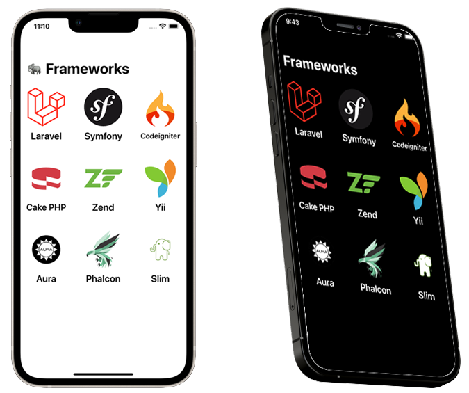
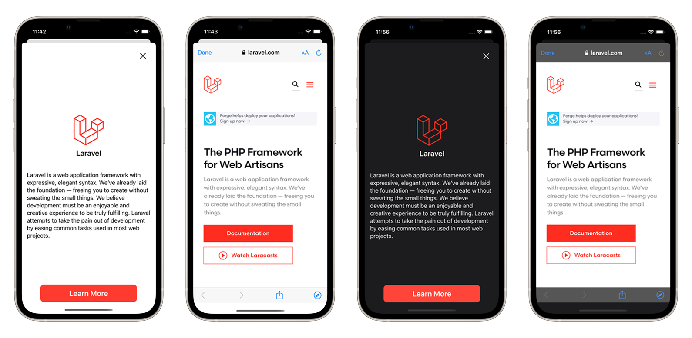
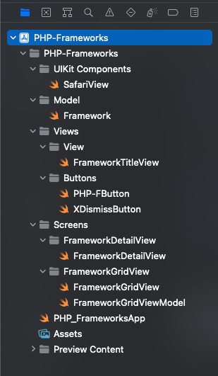

# PHP-Frameworks App

I am inspried by **Sean Allen** Course Apple-Frameworks which you'll find in his **SwiftUI fundamentals** 
Link:*https://seanallen.teachable.com/p/swiftui-fundamentals*, so I did it for **PHP frameworks** too. Though exactly the same a his. This project is very simple. I got it while learning the fundamentals. *Feel free to add some features*. 

For additional information that for some people that may not know what is **PHP language**. **PHP** *Hypertext Preprocessor* is a popular general-purpose scripting language that is especially suited to web development. Fast, flexible and pragmatic, PHP powers everything from your blog to the most popular websites in the world. PHP that earlier stood for Personal Home Page is one of the most popular general-purpose scripting (or web programming) languages used by millions of websites on the internet. According to a report, PHP is used by 79% of the websites using server-side programming languages. There's a lots of framework when talking about PHP languange and it's continue growing. These frameworks help the developers to promote RAD (Rapid Application Development) for saving time, building more stable applications, and reducing repetitive coding. PHP is used to create dynamic content that interacts with the databases of the applications and easier to learn in comparison to several programming languages.

Here's my screenshots light & dark mode for this PHP framework App.

Here's the snapped of the Project Architecture of the **PHP-frameworks** folder. It's the same approach as what *Sean Allen* style though in the future I'll be making my own preference. It's MVVM Model View ViewModel. **Model–view–viewmodel** (**MVVM**) is a software architectural pattern that facilitates the separation of the development of the graphical user interface (the *view*) – be it via a markup language or GUI code – from the development of the business logic or back-end logic (the *model*) so that the view is not dependent on any specific model platform. The *viewmodel* of MVVM is a value converter, meaning the viewmodel is responsible for exposing (converting) the data objects from the model in such a way that objects are easily managed and presented. In this respect, the viewmodel is more model than view, and handles most if not all of the view's display logic. The viewmodel may implement a mediator pattern, organizing access to the back-end logic around the set of use cases supported by the view.

